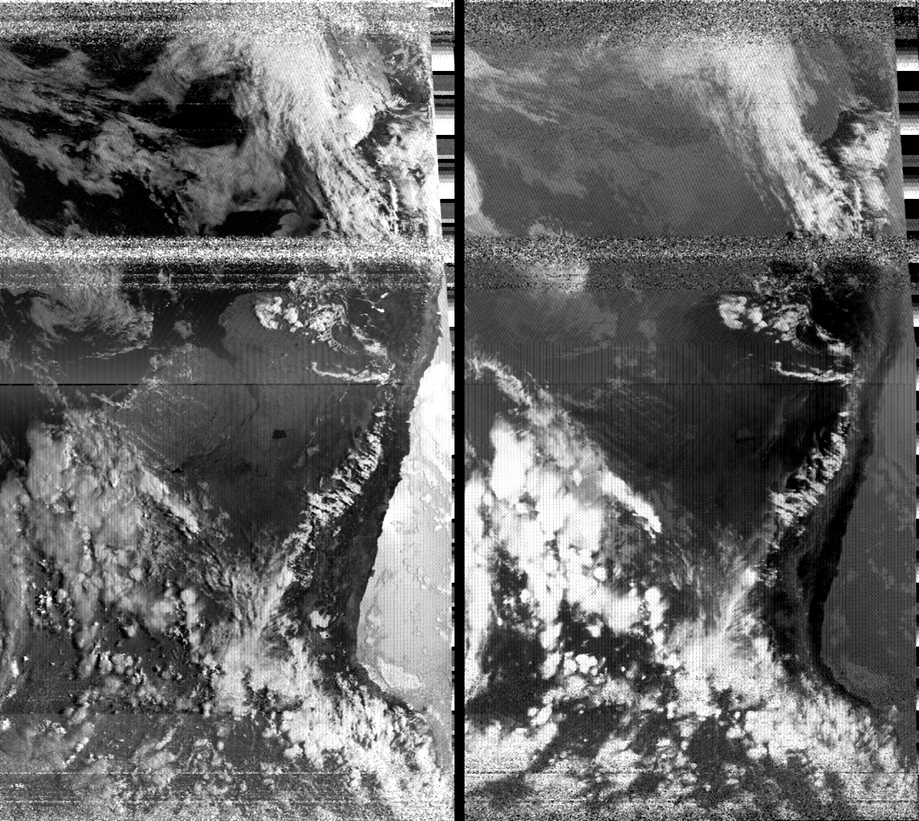

# NOAA APT Decoder

Décodeur d'images satellites NOAA APT (Automatic Picture Transmission) écrit en C.

Transforme un enregistrement audio `.wav` d'un passage satellite NOAA (15, 18 ou 19) en image BMP ou PNG exploitable, en reproduisant l'intégralité du pipeline de traitement du signal : démodulation AM, synchronisation par corrélation, rééchantillonnage, et post-traitement.



## Fonctionnalités

- **Démodulation AM** : redressement + moyenne glissante pour extraire l'enveloppe du signal
- **Synchronisation** : détection du motif sync A (1040 Hz) par corrélation croisée normalisée (NCC)
- **Rééchantillonnage** : conversion des ~5512 échantillons/ligne vers les 2080 pixels du format APT
- **Extraction de canaux** : séparation des canaux A (visible) et B (infrarouge)
- **Amélioration d'image** : étirement de contraste par percentiles et filtre médian pour le débruitage
- **Colormap thermique** : LUT thermique (noir → bleu → cyan → jaune → rouge) pour le canal infrarouge
- **Export BMP/PNG** : BMP 8-bit niveaux de gris ou 24-bit RGB, et PNG via libpng

## Compilation

```bash
make
```

Nécessite `gcc`, `make` et `libpng-dev`.

```bash
make clean   # Nettoyer les fichiers objets
```

## Utilisation

```bash
./decoder input.wav [options]
```

### Options

| Option | Description |
|---|---|
| `-o fichier.bmp` | Nom du fichier de sortie (défaut : `output.bmp`) |
| `-c A` | Extraire uniquement le canal A (visible) |
| `-c B` | Extraire uniquement le canal B (infrarouge) |
| `--enhance` | Appliquer un étirement de contraste |
| `--median` | Appliquer un filtre médian 3x3 (débruitage) |
| `--thermal` | Appliquer une colormap thermique |
| `--png` | Exporter en PNG au lieu de BMP |

### Exemples

```bash
# Image complète (les deux canaux)
./decoder samples/argentina.wav

# Canal visible avec amélioration de contraste
./decoder samples/argentina.wav -c A --enhance -o visible.bmp

# Canal infrarouge débruité
./decoder samples/argentina.wav -c B --median --enhance -o infrarouge.bmp

# Colormap thermique en PNG
./decoder samples/argentina.wav -c B --enhance --thermal --png -o thermal.png
```

## Architecture

```
noaa-decoder/
├── include/
│   ├── wav.h          # Lecture de fichiers WAV PCM
│   ├── demod.h        # Démodulation AM
│   ├── sync.h         # Synchronisation et découpe en lignes
│   ├── bmp.h          # Écriture BMP
│   ├── png_writter.h  # Écriture PNG
│   └── enhance.h      # Post-traitement d'image
├── src/
│   ├── main.c         # Point d'entrée et gestion des arguments
│   ├── wav.c          # Parser WAV (header + échantillons 16-bit)
│   ├── demod.c        # Redressement + lissage → pixels 0-255
│   ├── sync.c         # Corrélation NCC + découpe en lignes de 2080 px
│   ├── bmp.c          # Encodeur BMP 8-bit / 24-bit RGB
│   ├── png_writter.c  # Encodeur PNG via libpng
│   └── enhance.c      # Étirement de contraste, filtre médian, LUT thermique
├── samples/           # Fichiers WAV d'exemple
└── Makefile
```

### Pipeline de traitement

```
WAV 11025 Hz → Redressement → Lissage → Pixels 0-255 → Sync NCC → Lignes 2080 px → BMP/PNG
```

1. **wav.c** : lit le fichier WAV PCM 16-bit mono et normalise les échantillons en float [-1.0, +1.0]
2. **demod.c** : redresse le signal (valeur absolue) puis applique une moyenne glissante pour extraire l'enveloppe AM, convertit en pixels 0-255
3. **sync.c** : génère un motif sync A à 1040 Hz, localise chaque début de ligne par corrélation croisée normalisée, rééchantillonne chaque ligne à 2080 pixels
4. **enhance.c** : étirement de contraste par percentiles 2%-98%, filtre médian 3x3 par tri insertion, LUT thermique pour la colorisation infrarouge
5. **bmp.c** : écrit l'image en BMP 8-bit (palette de gris) ou 24-bit (RGB, pour la colormap thermique)
6. **png_writter.c** : écrit l'image en PNG (niveaux de gris ou RGB) via libpng

## Format APT

Le signal NOAA APT est une modulation AM à 2400 Hz transmise à 137 MHz. Chaque ligne de l'image (2080 pixels) est transmise en 0.5 seconde (2 lignes/seconde). Le format d'une ligne :

| Segment | Pixels | Description |
|---|---|---|
| Sync A | 39 | Tonalité 1040 Hz (marqueur de début canal A) |
| Space A | 47 | Niveaux de référence |
| Image A | 909 | Canal visible |
| Télémétrie A | 45 | Données de calibration |
| Sync B | 39 | Marqueur de début canal B |
| Space B | 47 | Niveaux de référence |
| Image B | 909 | Canal infrarouge |
| Télémétrie B | 45 | Données de calibration |

## Contexte

Ce projet est mon premier vrai projet en C, réalisé dans un but d'apprentissage. L'IA (Claude) m'a servi de professeur : elle m'a expliqué les concepts (traitement du signal, format APT, corrélation) et m'a montré du code pour que je comprenne. Elle n'a rien écrit directement dans le projet, j'ai retapé et réimplémenté l'intégralité du code moi-même, à la main, pour apprendre en pratiquant : la syntaxe du C, la gestion mémoire, la manipulation de fichiers binaires, etc. L'objectif était d'apprendre sur un projet concret plutôt que sur des exercices abstraits.

## Crédits

Le fichier WAV d'exemple provient de [noaa-apt](https://noaa-apt.mbernardi.com.ar/guide.html).

## Licence

Usage personnel et éducatif.
